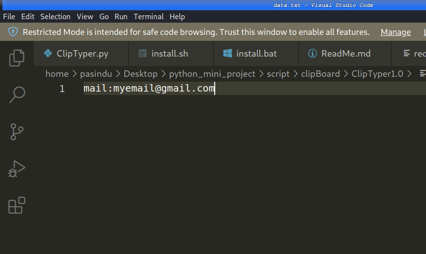
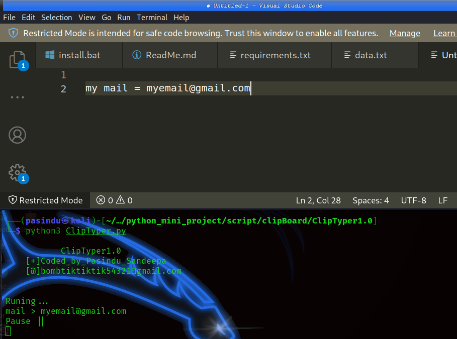

<h1> ClipTyper </h1>

step 1:

    Run install.bat if you are windows user.if you are linux user run install.sh. if it not work try with root permission.

 

step 2:

    Open data.txt and edit it.

        ex:- if you want type 'myemail@gmail.com' when you type 'mail' edit data.txt file like below.  
  

            mail:myemail@gmail.com

        <b>[!] Use ; between command and other words and dont use space between command and other words.</b>

 

step 3:

    Run ClipTyper.py

   Press Esc key to start programme.

    After start programme you try to type command

    Press Esc key again to pause programe

 
<b>
[+]Coded_by_Pasindu_Sandeepa
 
[@]bombtiktiktik54321@gmail.com</b>
